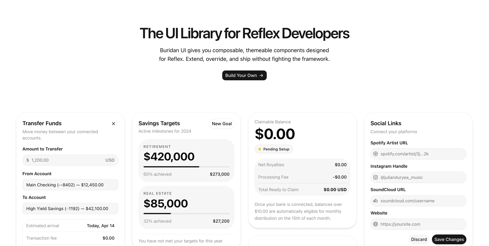

# buridan/ui

 Composable, themeable components designed for Reflex. Extend, override, and ship without fighting the framework. Open source. 
 

  

## Documentation

Visit [Docs](https://ui.buridan.dev/docs/getting-started/introduction) section to get started.

## Contributing

Please read this [guide](CONTRIBUTING.md) for more information on how to contribute.

## License

Licensed under the [MIT license](LICENSE.md).
